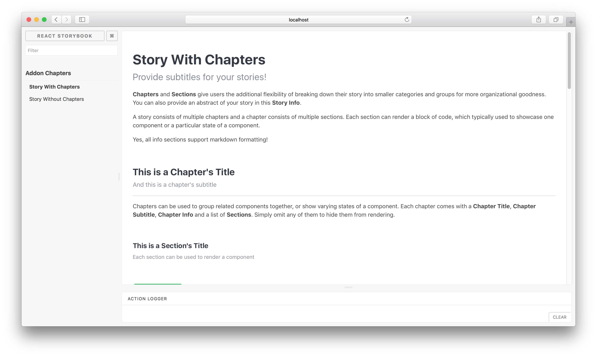

# React Storybook Chapters Addon

React Storybook Chapters addon allows showcasing of multiple components within a story by breaking it down into smaller categories (chapters) and subcategories (sections) for more organizational goodness.

Using the addon, a story can consist of multiple chapters and a chapter consists of multiple sections. Each section can render a block of code,
which typically used to showcase one component or a particular state of a component.

Chapters can be used to group related components together, or show varying states of a component.
Each chapter comes with a **Chapter Title**, **Chapter Subtitle**, **Chapter Info** and a list of **Sections**.
Simply omit any of them to hide them from rendering.

Each section comes with a **Section Title**, **Section Subtitle**, **Section Info**.

This addon was modified from [react-storybook-addon-info](https://github.com/storybooks/react-storybook-addon-info) and uses some of the component code from there.



## Usage

Install the following npm module:

```sh
npm install --save-dev react-storybook-addon-chapters
```

Then set the addon in the place you configure storybook like this:

```js
import React from 'react';
import { configure, setAddon } from '@storybook/react';
import chaptersAddon from 'react-storybook-addon-chapters';

setAddon(chaptersAddon);

configure(function () {
  ...
}, module);
```
To turn off the default styles add:
```js

setDefaults({sectionOptions: {useTheme: false}});

```

All rendered components have a specified class.  With the 'useTheme' set to false you should have no problem styling your chapters.


Then create your stories with the `.addWithChapters` API.

```js
import React from 'react';
import Button from './Button';
import { storiesOf } from '@storybook/react';

storiesOf('Addon Chapters')
  .addWithChapters(
    'Story With Chapters',
    {
      subtitle: <Optional story subtitle>,
      info: <Optional story info>,
      chapters: [
        // List of chapters. Refer to Configuration Format section.
        {
          title: <Optional chapter title>,
          subtitle: <Optional chapter subtitle>,
          info: <Optional chapter info>,
          sections: [
            // List of sections.
            {
              title: <Optional section title>,
              subtitle: <Optional section subtitle>,
              info: <Optional section info>,
              sectionFn: () => (<Button label="My Button" onClick={() => { alert('Hello World!'); }}/>),
              options: {
                showSource: true,
                allowSourceToggling: true,
                showPropTables: true,
                allowPropTablesToggling: true,
              },
            },
            ...
          ],
        },
        ...
      ]
    }
  );
```

> Have a look at [this example](example/story.js) stories to learn more about the `addWithChapters` API.

## Global options

To configure default options for all chapter sections (`section.options`), use `setDefaults` in `.storybook/config.js`	. 

```js
import React from 'react';
import { configure, setAddon } from '@storybook/react';
import chaptersAddon, { setDefaults } from 'react-storybook-addon-chapters';

// optionally override defaults
setDefaults({
  sectionOptions: {
    showSource: true,
    allowSourceToggling: true,
    showPropTables: false,
    allowPropTablesToggling: true,
    decorator: story => (<div>{story()}</div>),
  }
});
setAddon(chaptersAddon);

configure(function () {
  ...
}, module);
```

## Configuration Format

#### Story

| Key | Description |  Type | Default |
|-|-|-|-|
| subtitle | Story subtitle | String | - |
| info | Additional information for the story | String (markdown) | - |
| chapters | An array of Chapter objects | Array<Chapter> | - |

#### Chapter

| Key | Description |  Type | Default |
|-|-|-|-|
| title | Chapter title | String | - |
| subtitle | Chapter subtitle | String | - |
| info | Additional information for the chapter | String (markdown) | - |
| sections | An array of Section objects | Array<Section> | - |

#### Section

| Key | Description |  Type | Default |
|-|-|-|-|
| title | Section title | String | - |
| subtitle | Section subtitle | String | - |
| info | Additional information for the section | String (markdown) | - |
| sectionFn | A function that returns a React component to be displayed | Function | - |
| options | A configuration object for this section. Refer to the next few rows for the keys | Object | - |
| options.showSource | Display the component's source | Boolean | True |
| options.allowSourceToggling | Allow showing/hiding of the component's source | Boolean | True |
| options.showPropTables | Display the component's propTypes | Boolean | False |
| options.allowPropTablesToggling | Allow showing/hiding of the component's propTypes | Boolean | True |
| options.decorator | An optional decorator function that will be used for rendering the component in section | Function | - |

## The FAQ

**Components lose their names on static build**

Component names also get minified with other javascript code when building for production. When creating components, set the `displayName` static property to show the correct component name on static builds.
